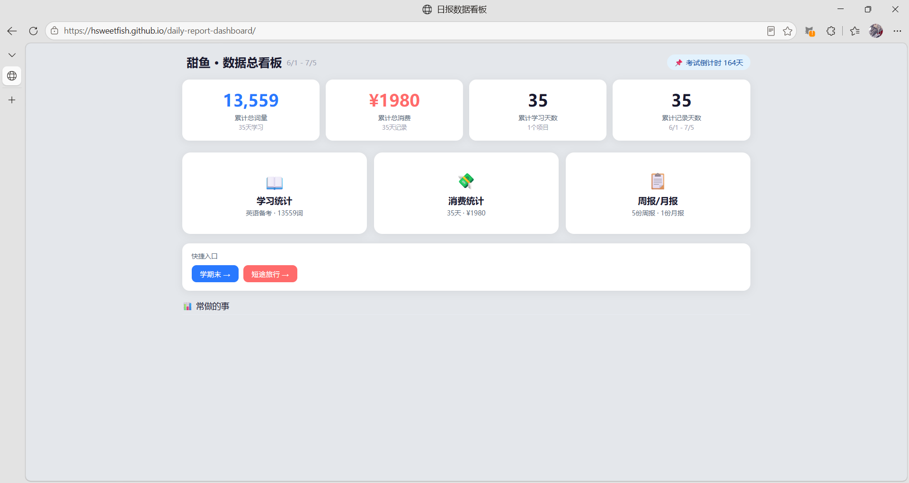

# 日报数据看板

个人学习与消费数据可视化工具，纯静态 HTML 实现，Chart.js 驱动，无需后端。

[在线演示](https://hsweetfish.github.io/daily-report-dashboard/)



## 功能

- **数据总览** — 累计学习词量、消费总额、学习/记录天数一目了然
- **学习统计** — 多来源数据汇总，复习/新词趋势，App 占比分析
- **消费统计** — 逐日明细、分类饼图、日历热力图、Top5 高亮
- **周报与月报** — 自动生成消费汇总和分析摘要，支持一键复制
- **特殊时期** — 备考期、出行期快捷入口，时段筛选对比

## 快速开始

直接用浏览器打开 `index.html` 即可使用。

## 技术栈

- HTML5 + CSS3（响应式布局）
- [Chart.js](https://www.chartjs.org/) 图表库
- 纯前端，数据与视图分离

## 替换为自己的数据

所有数据存放在 `data.js` 中的 `DATA_RAW` 对象里，有两种方式替换。

### 方式一：让 AI 帮你生成（推荐）

将以下提示词发给 ChatGPT、Claude 等 AI，它会直接帮你生成完整的数据文件：

<details>
<summary>📋 点击展开提示词模板</summary>

```
我需要你帮我生成一个数据文件，用于一个叫"日报数据看板"的 HTML 看板工具。
请严格按照以下 JSON 结构，用我的真实数据填充，输出完整的 var DATA_RAW = { ... }; 代码。

数据时间范围：____ 到 ____（如 7/1 - 7/31）
考试倒计时日期：____（如 2026-12-20，不需要可以填 null）

特殊时期（可选）：
- study 类型（学习期）：名称____、起止____ 到 ____
- expense 类型（消费期）：名称____、起止____ 到 ____

学习项目：
- 项目名称：____
- App 名称列表：____（如 百词斩、墨墨背单词）
- 每天的复习词数和新学词数

消费记录（每天）：
- 日期（如 7/1）、当天标签（如 在校/旅游/日常）
- 每笔消费的名称、金额、分类（餐饮/交通/购物/娱乐/住宿/医疗/其他）

另外请生成：
- 每周报告：范围、总消费、日均消费、Top3 分类、一句话总结、关键词
- 月度报告：同上，范围覆盖整月

收入备注（可选）：日期、来源、金额

参考示例（一条消费记录）：
{
  "date": "7/1",
  "total": 45,
  "tag": "在校",
  "items": [
    { "name": "食堂盖饭", "amount": 13, "cat": "餐饮" },
    { "name": "奶茶", "amount": 9, "cat": "餐饮" },
    { "name": "水果", "amount": 8, "cat": "餐饮" }
  ]
}

现在请根据我给的数据，输出完整的 var DATA_RAW = { ... }; 代码，不要省略任何字段。
```
</details>

把上面模板中的下划线替换成你自己的实际信息，然后把整段话发给 AI 即可。

### 方式二：手动编辑

打开 `data.js`，按照以下结构修改：

```
var DATA_RAW = {
  meta: {
    title, dateRange, examDate, updatedAt,    // 基本信息和考试倒计时
    specialPeriods: [{ id, type, start, end, label, color }],  // 可选
    categoryColors: { "餐饮":"#e17055", ... }  // 消费分类颜色
  },
  studyProjects: [{
    label, dateLabels: ["7/1", "7/2", ...],   // 学习期每天的日期
    apps: { "App名": [每日词数, ...] },       // 每个App的每日数据
    review: [每日复习词数, ...],
    newWords: [每日新学词数, ...],
    totals: [每日总词数, ...]
  }],
  expenses: [{
    date: "7/1", total: 45, tag: "在校",      // total = items 金额之和
    items: [{ name: "午餐", amount: 13, cat: "餐饮" }, ...]
  }],
  weeklyReports: [{ id, range, weekIndex, totalCost, avgDailyCost, topCategories: [], summary, keywords: [], autoGenerated: true }],
  monthlyReports: [{ id, range, monthLabel, totalCost, avgDailyCost, topCategories: [], summary, keywords: [], autoGenerated: true }],
  incomeNotes: [{ date, source, amount }]     // 可选
}
```

分类可选值：`餐饮` `交通` `购物` `娱乐` `住宿` `医疗` `其他`。

## 定制页面显示

替换数据后，以下三处也需要同步调整，否则展示内容会跟数据对不上。

### 首页「常做的事」

这部分在 `index.html` 的 `renderFrequentStats` 函数中，靠关键词匹配数据来统计。换数据后需要更新：

<details>
<summary>📋 AI 提示词模板</summary>

```
我使用了一个叫"日报数据看板"的 HTML 工具，现在需要你帮我更新 index.html 中的 renderFrequentStats 函数。

我的新数据中有以下消费条目（列出你数据中出现频率高的项目），请帮我：

1. 更新 drinkKw 数组，填入我数据中出现的饮品名称
2. 更新 foodCounts 匹配数组，填入我数据中高频出现的食物名称
3. 更新六个卡片的内容，让每个卡片展示我数据中有意义的统计（比如最常吃的单品、出行次数、娱乐总消费等）
4. 给每个卡片配上对应的 highlight 关键词，让用户点击卡片后能高亮相关消费记录

以下是我的高频消费项目清单：
- 饮品：____（如 奶茶 8次、咖啡 5次）
- 食物：____（如 馄饨 9次、炸酱面 7次、麻辣烫 5次）
- 出行：____（如 打车 4次）
- 娱乐：____（如 电影票 3次，总消费 ¥120）
- 住宿：____（如 酒店 3晚，总消费 ¥450）
- 其他值得展示的：____

请输出修改后的完整 renderFrequentStats 函数代码。
```
</details>

手动修改的话，找到 `index.html` 中 `renderFrequentStats` 函数，改里面的关键词数组和卡片 HTML 模板即可。

### 周报和月报

周报和月报的文本总结同样需要用 AI 生成：

<details>
<summary>📋 AI 提示词模板</summary>

```
我使用了一个叫"日报数据看板"的 HTML 工具，现在需要你帮我生成周报和月报数据。

以下是时间段和消费概况，请为每个报告生成 JSON 对象，格式为：
{
  "id": "w1",
  "range": "7/1-7/7",
  "weekIndex": 1,
  "totalCost": 总消费（数字）,
  "avgDailyCost": 日均消费（数字）,
  "topCategories": ["分类1", "分类2", "分类3"],
  "summary": "一段自然的中文总结，50字以内",
  "keywords": ["关键词1", "关键词2"],
  "autoGenerated": true
}

我的消费数据概况：
[在这里粘贴你的数据摘要，AI 会帮你算好数字并写好总结]
```
</details>

### 特殊时期和考试倒计时

`data.js` 中的 `meta.specialPeriods` 控制首页快捷入口和高亮筛选，`meta.examDate` 控制倒计时。换数据时记得同步更新这两个字段。不需要倒计时的话把 `examDate` 设为 `null` 即可。

## 开源协议

[MIT](LICENSE)
